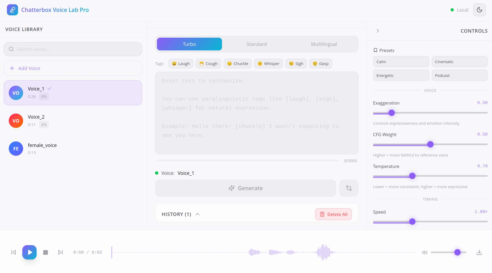

# Chatterbox Voice Lab Pro

A production-grade, local-first voice cloning and synthesis studio powered by [Chatterbox TTS](https://github.com/resemble-ai/chatterbox) by Resemble AI.

## Screenshot



## Features

### V1 (Core)
- **Voice Library** — drag & drop upload, auto-converts to WAV 16kHz mono, waveform preview
- **3 TTS Models** — Turbo (fastest), Standard (English), Multilingual (23+ languages)
- **All Parameters Exposed** — exaggeration, cfg_weight, temperature, speed, seed, top_p/k, repetition penalty
- **Paralinguistic Tags** — `[laugh]`, `[cough]`, `[chuckle]`, `[whisper]`, `[sigh]`, `[gasp]`
- **A/B Comparison** — compare Turbo vs Multilingual side-by-side with synchronized waveforms
- **Real-time WebSocket Progress** — live generation status updates
- **Generation History** — playback, download, delete past outputs
- **Preset System** — Podcast, Cinematic, Energetic, Calm presets built-in
- **Timeline Editor** — multi-clip projects with reordering
- **Multi-Speaker Scene Builder** — assign different voices per speaker track
- **Smart Text Chunking** — automatic splitting for long texts
- **Audio Post-Processing** — normalize, trim silence, EQ, compression
- **Batch Job Queue** — parallel generation pipeline

## Quick Start

### CPU (default)
```bash
cp .env.example .env
make build
make up
```

Open [http://localhost:8080](http://localhost:8080)

### GPU (NVIDIA)
```bash
cp .env.example .env
# Set DEVICE=cuda in .env
make build
docker compose -f docker-compose.yml -f docker-compose.gpu.yml up -d
```

### Development (hot-reload)
```bash
make dev
# Frontend: http://localhost:5173
# Backend: http://localhost:8000
```

## Pre-download Models (optional, avoids first-run delay)
```bash
make up
make download-models
```

## Architecture

```
nginx:8080
  ├── /        → React frontend (Vite + TailwindCSS + shadcn/ui)
  ├── /api/v1  → FastAPI backend (Python 3.11)
  └── /ws      → WebSocket (real-time progress)

Backend Services:
  ├── EngineManager  — singleton model loader, LRU eviction, async generation
  ├── VoiceService   — upload, FFmpeg processing, CRUD
  ├── GenerationService — orchestrates TTS, saves WAV output
  └── SQLite + aiosqlite — voice profiles, generations, presets, projects

Storage: ./data/{voices, outputs, projects, db, models}
```

## API

| Method | Endpoint | Description |
|--------|----------|-------------|
| `GET` | `/api/v1/voices` | List voice profiles |
| `POST` | `/api/v1/voices` | Upload voice (multipart) |
| `POST` | `/api/v1/generate` | Generate speech (→ 202 + job_id) |
| `POST` | `/api/v1/generate/ab` | A/B comparison |
| `GET` | `/api/v1/generate/{id}/audio` | Stream generated audio |
| `GET` | `/api/v1/presets` | List parameter presets |
| `WS` | `/ws` | Real-time generation progress |

## Keyboard Shortcuts

| Key | Action |
|-----|--------|
| `Ctrl+Enter` | Generate speech |
| `Space` | Play/pause audio |

## Models

| Model | Size | Speed | Languages | Paralinguistic |
|-------|------|-------|-----------|----------------|
| Turbo | 350M | Fastest | English | ✅ |
| Standard | 500M | Fast | English | ❌ |
| Multilingual | 500M | Fast | 23+ | ✅ |

## Requirements

- Docker + Docker Compose
- 8GB+ RAM recommended (16GB for multiple models)
- NVIDIA GPU optional (CUDA 12.1+), CPU fallback supported

## Troubleshooting

### `502` on voice upload or API calls

If uploads fail with `Request failed with status code 502`, the backend may be restarting during startup.

Check backend logs:
```bash
docker compose logs --tail=200 backend
```

If you see `sqlite3.OperationalError: unable to open database file`, verify `DATABASE_URL` uses an absolute SQLite path with four slashes:
```bash
DATABASE_URL=sqlite+aiosqlite:////app/data/db/voicelab.db
```

Using three slashes (`sqlite+aiosqlite:///...`) is interpreted as a relative path and can prevent backend startup.

### Voice clip becomes too short after upload

If generation fails with a message about a voice prompt needing around 5 seconds, your processed voice sample is too short.

- Upload 5-60 seconds of clear speech.
- Avoid long silence-only sections.
- If needed, trim silence in an editor before upload and keep continuous spoken audio.
